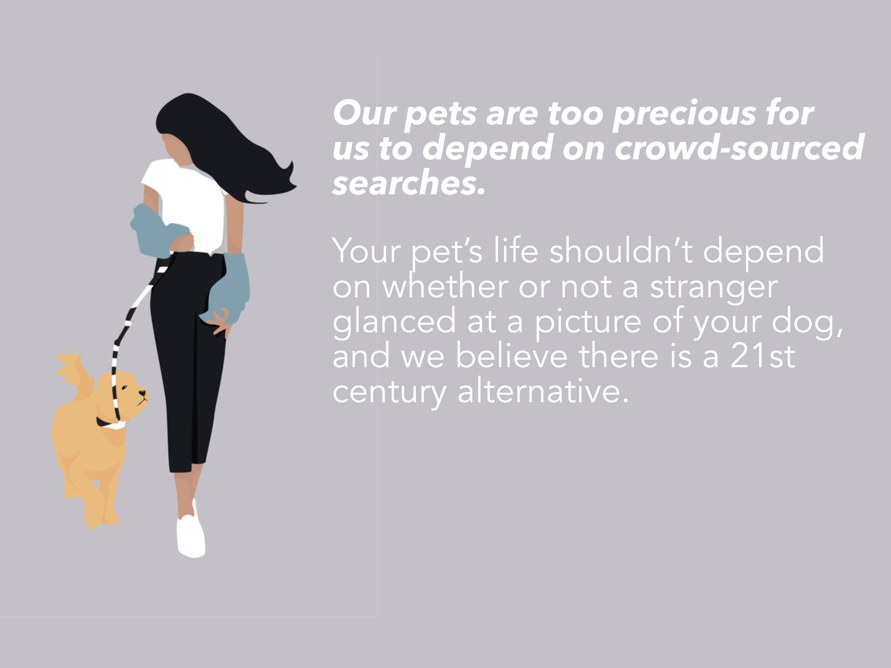
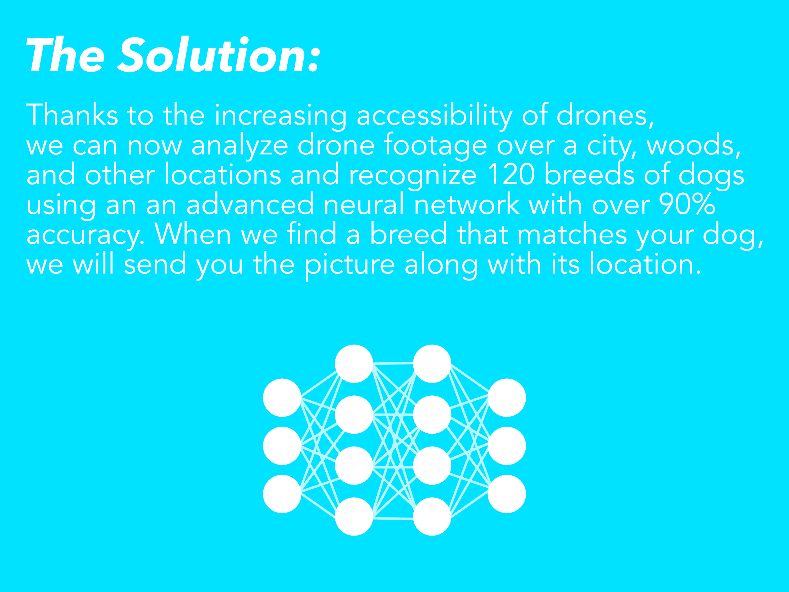

<!DOCTYPE HTML>
<html>
   <head>
      <title>Verlan</title>
      <meta charset="utf-8" />
      <meta name="viewport" content="width=device-width, initial-scale=1, user-scalable=no" />
      <link rel="stylesheet" href="assets/css/main.css" />
      <link rel="shortcut icon" type="image/x-icon" href="favicon.ico">
    
      <noscript>
         <link rel="stylesheet" href="assets/css/noscript.css" />
      </noscript>
   </head>
   <body class="is-preload">
      <!-- Wrapper -->
      

         <!-- Header -->
         <header id="header" class="alt">
            <a href="index.html" class="logo"><strong>Verlan</strong> </a>
            <nav>
               <a href="#menu">Menu</a>
            </nav>
         </header>
         <!-- Menu -->
         <nav id="menu">
            <ul class="links">
				<li><a href="index.html">Home</a></li>
				<li><a href="http://127.0.0.1:5000/adopt">Dronit</a></li>
				<li><a href="http://127.0.0.1:5000">Brinder</a></li>
         </nav>
         <!-- Banner -->
         <section id="banner" class="major">
            

               <header class="major">
               <h1>Verlan</h1>
               

                  
The Paw Hub

                  <ul class="actions">
                     <li><a href="https://github.com/ayush4921/Verlan" class="button next scrolly">Project</a></li>
                  </ul>
               

            

         </section>
         

            

               <embed class="major" src="effects\typed-jsexample\typed-jsexample\dist\index.html" style="width: 100%; height: 200px; margin-top: 0px; margin-bottom: 0px; padding-bottom: 0px;" >
			

			<embed class="major" src="static\dist_slider\index.html" style="width: 100%; height:500px; margin-top: 0px; margin-bottom: 0px; padding-bottom: 0px;" >

            <embed class="major" src="effects\split-slick-slideshow\split-slick-slideshow\dist\index.html" style="width: 100%; height:400px; margin-top: 0px; margin-bottom: 0px; padding-bottom: 0px;" >
         

		
		
		
		<embed class="major" src="harlowthe-css3-animated-pug\dist\index.html" style="width: 100%; height: 300px; margin-top: 0px; margin-bottom: 0px; padding-bottom: 0px;" >

	

	  
      

      
      
      
      
      
      
      
   </body>
</html>